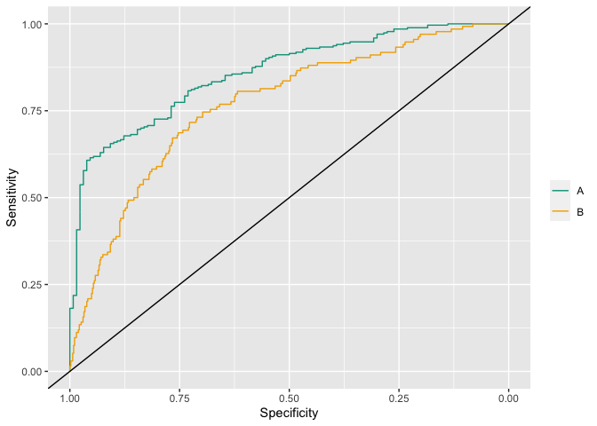
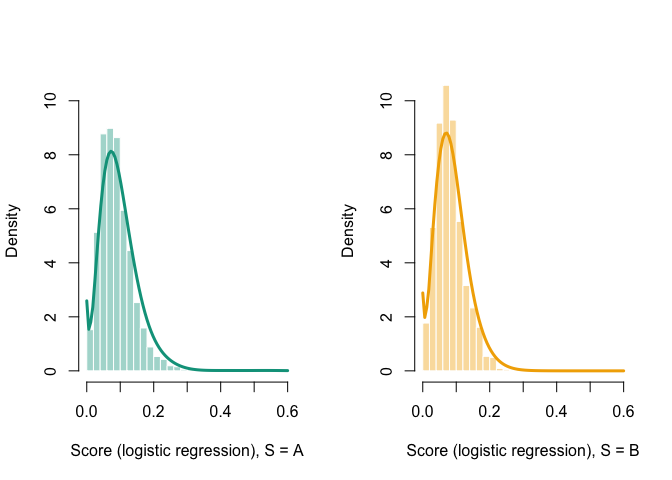

`InsurFair` R package
================
Arthur Charpentier

Codes and Data associated with Insurance, biases, discrimination and fairness

# Install the `InsurFair` library

The `InsurFair` library can be installed from *github*,

``` r
library(devtools)
devtools::install_github("freakonometrics/InsurFair")
library(InsurFair)
```
    ## 

``` r
library(InsurFair)
```

``` r
data(COLORS)
```

``` r
data(toydata2)
model_gam = mgcv::gam(y~s(x1,k=12,bs="cr")+s(x2,k=12,bs="cr")+s(x3,k=12,bs="cr"),
data=toydata2,family=binomial)
pred_y = predict(model_gam, type="response")
F = fair_metrics(pred_outcome = pred_y)
F$pred_rate_parity$Probability_plot+ scale_fill_manual( values = COLORS[c("B","A")])
```

<!-- -->

``` r
F$roc_parity$ROCAUC_plot+ scale_color_manual(values = c("1"=COLORS["A"], "2"=COLORS["B"]), labels = c("1"="A","2"="B"))
```

<!-- -->

``` r
data(frenchmotor)
data(COLORS)
library(kdensity)
model = glm((y=="1")~., data=frenchmotor, family=binomial)
py = predict(model, newdata = frenchmotor, type="response")
pyA = py[frenchmotor$sensitive=="Male"]
pyB = py[frenchmotor$sensitive=="Female"]

par(mfrow=c(1,2))

hist(pyA,probability = TRUE,xlab="Score (logistic regression), S = A", col=scales::alpha(COLORS["A"],.4), border="white",main="",breaks=seq(0,.6,by=.02),ylim=c(0,10.4))
dA = density_score(pyA[sample(1:length(pyA),size=1500)],b=.01)
vx = seq(0,.6,length=101)
lines(vx,dA(vx),col=COLORS["A"],lwd=3)

hist(pyB,probability = TRUE,xlab="Score (logistic regression), S = B", col=scales::alpha(COLORS["B"],.4), border="white",main="",breaks=seq(0,.6,by=.02),ylim=c(0,10.4))
dB = density_score(pyB[sample(1:length(pyB),size=1500)],b=.01)
vx = seq(0,.6,length=101)
lines(vx,dB(vx),col=COLORS["B"],lwd=3)
```

<!-- -->

``` r
library(locfit)
```

    ## locfit 1.5-9.8    2023-06-11

``` r
pcA = plot_calibration(pyA,(frenchmotor$y[frenchmotor$sensitive=="Male"]=="1")*1,u = seq(0,.25,length=201),a=.2)
pcB = plot_calibration(pyB,frenchmotor$y[frenchmotor$sensitive=="Female"]=="1",u = seq(0,.25,length=201),a=.2)

par(mfrow=c(1,2))

plot(pcA,col=COLORS["A"],lwd=3,xlab="Predictions",ylab="Observations",type="l")
abline(a=0,b=1,col="grey")

plot(pcB,col=COLORS["B"],lwd=3,xlab="Predictions",ylab="Observations",type="l")
abline(a=0,b=1,col="grey")
```

<!-- -->

``` r
draw_transport(pyA, pyB, dA, dB, 
                          limA = c(0,.3), limB=c(0,.3),
                          limY = c(0,12),
                          lab = c("A","B"), 
                          sub = 6)
```

<!-- -->
